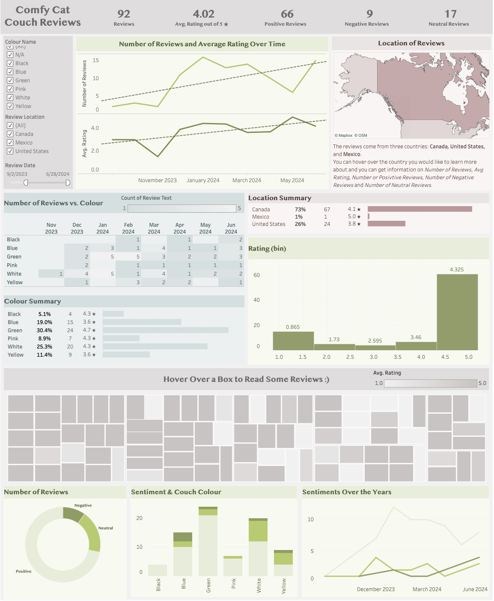

# Amazon Cat Couch Reviews (2023 - 2024)
Analyzing Amazon reviews from 2023 - 2024 for [cat couch](https://www.amazon.ca/Washable-Medium-Durable-Non-Slip-26%C3%9719%C3%9713/dp/B0C5DMLPNC/ref=cm_cr_arp_d_product_top?ie=UTF8). Interactive Tableau dashboard can be found [here](https://public.tableau.com/app/profile/johanna.schmidle/viz/CatCouchDash/Dashboard1).

    

## Motivation
Gain insights into the reviews of an Amazon product to understand factors that affect customer satisfaction. And for fun I can determine if I should purchase the product myself, and which version would be the best choice.

## Task List
1. Collect Data from Amazon + add sentiment column based on review text ([CatCouchScrape.ipynb](https://github.com/johannaschmidle/Amazon-Cat-Couch/blob/main/CatCouchScrape.ipynb))
2. Clean dataset (_Cleaned table:_ [CatCouchReviewTable.csv](https://github.com/johannaschmidle/Amazon-Cat-Couch/blob/main/CatCouchReviewTable.csv))
3. Create Visualization ([Tableau Dashboard](https://public.tableau.com/app/profile/johanna.schmidle/viz/CatCouchDash/Dashboard1))
4. Bonus: EDA + Sentiment Analysis ([CatCouchPdf.pdf](https://github.com/johannaschmidle/Amazon-Cat-Couch/blob/main/CatCouchPdf.pdf))

## Data
**Source:** Scraped from Amazon, then added a sentiment column in Python. \
This dataset can be used in various ways, such as natural language processing, sentiment analysis, product recommendations, or market research.

**Main Metrics:**
- **Review rating:** out of 5 stars
- **Sentiment:** indicates how the customer feels about the product (positive review, negative review, or neutral review)
- **Number of Reviews:** Total number of reviews
  
**Other fields:**
- Reviewer Name: The username of the person leaving the review
- Title: The title of the review
- Colour Name: The colour the cat couch was purchased in
- Review Location: The country where the reviewer is located
- Review Date: Date the review was posted (yyyy-mm-dd)
- Review Text: The text description of the review

## Summary of Insights
#### Rating
- The average rating began to slowly decrease around August/September 2023, hitting its lowest point around November 2023. After that, it gradually increased, reaching its highest point after April 2024.
- Ratings predominantly cluster around 4.5 stars, but a significant number of ratings are also around 1 star.
- The green couch has the highest average rating at approximately 4.7 stars. The blue and yellow couches have the lowest average ratings at 3.6 stars.
- Mexico and Canada have high average ratings (5.0 stars and 4.1 stars, respectively), while the United States has a lower average rating (3.6 stars). However, it's important to note that Mexico only has one review, so this may not accurately reflect overall customer satisfaction.
#### Sentiment
- Most reviews are positive, followed by neutral, and then negative.
- The blue couch has the highest percentage of negative reviews compared to total reviews for that color.
- The yellow couch has the highest percentage of neutral reviews compared to total reviews for that color.
- The black couch technically has the highest percentage of positive reviews compared to total reviews for that color, but it also has the fewest reviews (only 4), which may skew the results. The green couch has the second-highest percentage of positive reviews.
- Positive reviews steadily increased from late August 2023 to January 2024, then slowly decreased.
- Neutral reviews peaked in December 2023, decreased, and then increased again in April 2024.
- Negative reviews remained relatively low but began to increase just before April 2024.
#### Number of Reviews
- Review counts remained low until November 2023 (when ratings hit their lowest point), then remained high until March 2024. After that, the count decreased until it started increasing again after April 2024.
- Canada has the most reviews, while Mexico has the fewest.
- The green couch has the most reviews, and the black couch has the fewest. 
#### Overall
- The green couch is the most popular (most reviews) and has the highest customer satisfaction in terms of positive reviews and ratings.
- The blue couch has the lowest customer satisfaction in terms of negative reviews and ratings.
- The black couch is the least popular in terms of the number of reviews.
- Canada has the highest customer satisfaction in terms of ratings (76% positive reviews).
- The United States has the lowest customer satisfaction in terms of ratings (25% negative reviews).

## Recommendations and Next Steps 
- Compare sentiment trends over time to see if customer satisfaction shifts with changes in the product or its marketing.
- Investigate if there are any patterns in reviews based on the location, gender, or age of the reviewer.
- Conduct a time series analysis to identify trends and seasonal patterns in reviews.
- Predict future review trends based on historical data.
  
## Technologies
- Python (Selenium, BeautifulSoup)
- Excel
- Tableau
- R
